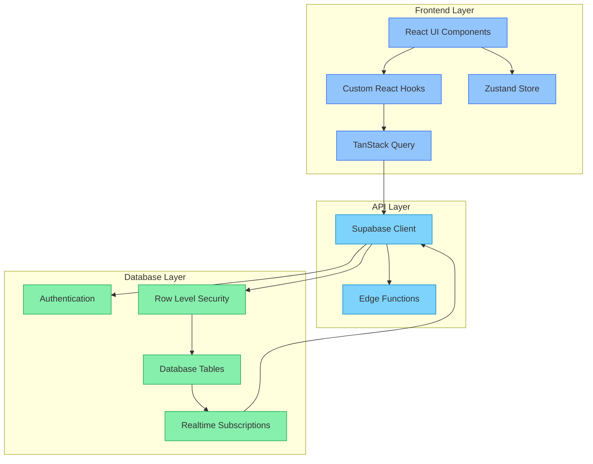
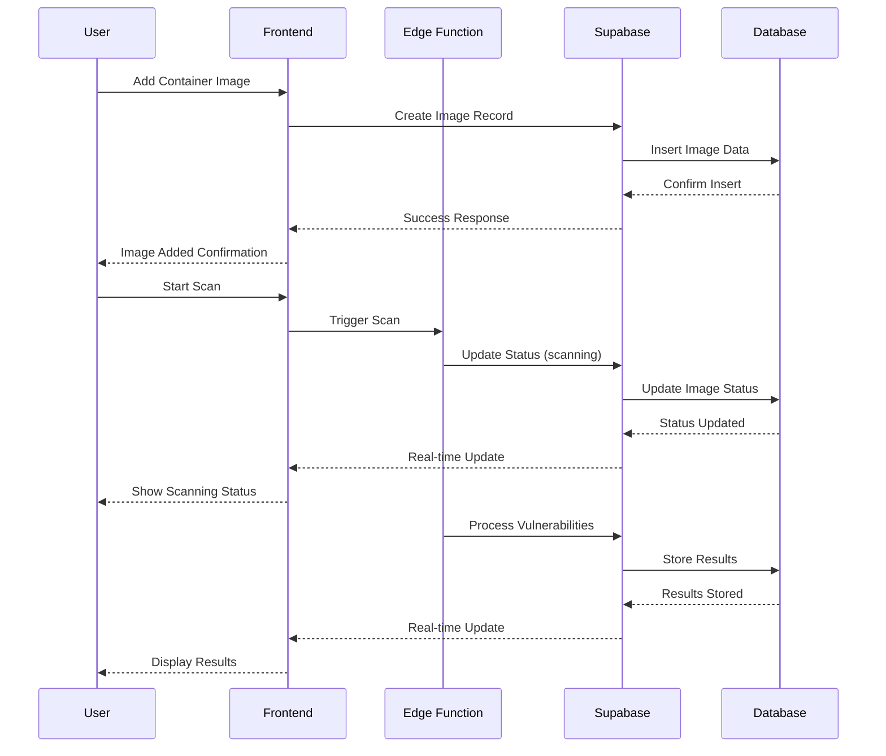

# Accuknox PM | Harsh Assignment

[](https://reactjs.org/)
[](https://supabase.io/)
[](https://tailwindcss.com/)
[](https://www.typescriptlang.org/)

**Problem Statement for Product Manager**

**Problem Statement 1:**
Title: Product Requirement and Low-Fidelity Wireframes

**Background/Task:**
A security product requires scanning container images and showing users the findings.
Container images contain applications with their dependencies and all these components
might have known vulnerabilities.

**As a user:**
I need to understand which container images have vulnerabilities and how severe they are.
If there are any critical or high vulnerabilities, I need to fix them and thus need to identify
which images have to be fixed.
I have thousands of images in my repository.
Help us build a product requirements/wireframe that can help users solve the above
problems.

**Deliverables:**
Create a Product Requirements document for the above.
Create low-fidelity wireframes for the user interface for this product.
(Bonus/Optional Task) Identify development action items that can be discussed with the
development team


## Low-Fidelity Wireframes

**1. Approach of Wireframe Design**

<br><br>

**2. Notebook Handmade Design**
 
<br><br>


## Architecture



## Workflow



## Features

- **Real-time Scanning**: Instant vulnerability detection and analysis
- **Comprehensive Dashboard**: Visual representation of security metrics
- **Batch Operations**: Manage multiple images simultaneously
- **Export Capabilities**: Generate detailed CSV reports
- **Compliance Monitoring**: Track security scores and compliance status
- **Real-time Updates**: Live notifications for scan status changes
- **Multi-user Support**: Secure, isolated environments for each user

## Tech Stack

- **Frontend**: React 18.3.1 with TypeScript
- **State Management**: TanStack Query + Zustand
- **Styling**: TailwindCSS
- **Backend**: Supabase (PostgreSQL + Authentication)
- **Real-time**: Supabase Realtime
- **Charts**: Recharts
- **Icons**: Lucide React

## Project Structure

```
container-security-scanner/
├── src/
│   ├── components/         # React components
│   ├── hooks/             # Custom React hooks
│   ├── lib/               # Utility functions and configurations
│   ├── providers/         # Context providers
│   └── store/             # State management
├── supabase/
│   ├── functions/         # Edge functions
│   └── migrations/        # Database migrations
└── public/               # Static assets
```

## Quick Start

### Prerequisites

- Node.js 18+
- npm or yarn
- Supabase account

### Installation

1. Clone the repository:
   ```bash
   git clone https://github.com/harsh3311/accuknox-harsh.git
   cd accuknox-harsh3311
   ```

2. Install dependencies:
   ```bash
   npm install
   ```

3. Set up environment variables:
   ```bash
   cp .env.example .env
   ```
   Update with your Supabase credentials:
   ```
   VITE_SUPABASE_URL=your_supabase_url
   VITE_SUPABASE_ANON_KEY=your_supabase_anon_key
   ```

4. Start the development server:
   ```bash
   npm run dev
   ```

## Authentication Flow

1. **Sign Up**:
   ```typescript
   const { user } = await supabase.auth.signUp({
     email: 'user@example.com',
     password: 'secure_password'
   });
   ```

2. **Email Verification**:
   - Automatic email sent via Supabase
   - Click verification link
   - Redirect back to application

3. **Sign In**:
   ```typescript
   const { user } = await supabase.auth.signInWithPassword({
     email: 'user@example.com',
     password: 'secure_password'
   });
   ```

## Database Schema

### Container Images Table
```sql
CREATE TABLE container_images (
  id uuid PRIMARY KEY DEFAULT gen_random_uuid(),
  name text NOT NULL UNIQUE,
  registry_url text,
  critical_vulnerabilities integer DEFAULT 0,
  high_vulnerabilities integer DEFAULT 0,
  medium_vulnerabilities integer DEFAULT 0,
  status text DEFAULT 'pending',
  last_scan timestamptz,
  created_at timestamptz DEFAULT now(),
  updated_at timestamptz DEFAULT now(),
  user_id uuid REFERENCES auth.users(id) NOT NULL
);
```

### Scan History Table
```sql
CREATE TABLE scan_history (
  id uuid PRIMARY KEY DEFAULT gen_random_uuid(),
  image_id uuid REFERENCES container_images(id) ON DELETE CASCADE,
  status text NOT NULL,
  scan_started_at timestamptz DEFAULT now(),
  scan_completed_at timestamptz,
  vulnerabilities_found jsonb DEFAULT '{}'::jsonb,
  user_id uuid REFERENCES auth.users(id) NOT NULL
);
```

## Security Features

### Row Level Security (RLS)
```sql
-- Example RLS Policy
CREATE POLICY "Users can view their own images"
  ON container_images
  FOR SELECT
  TO authenticated
  USING (auth.uid() = user_id);
```

### Real-time Subscriptions
```typescript
supabase
  .channel('container_images_changes')
  .on('postgres_changes', { 
    event: '*', 
    schema: 'public', 
    table: 'container_images' 
  }, (payload) => {
    // Handle real-time updates
  })
  .subscribe();
```

## API Usage

### Adding Images
```typescript
const { data, error } = await supabase
  .from('container_images')
  .insert({
    name: 'nginx:latest',
    registry_url: 'registry.hub.docker.com',
    status: 'pending',
    user_id: user.id
  });
```

### Starting Scans
```typescript
const { error } = await supabase
  .from('container_images')
  .update({ 
    status: 'scanning',
    last_scan: new Date().toISOString()
  })
  .eq('id', imageId);
```

## Data Export

The application supports CSV exports with the following format:
```csv
Image Name,Registry URL,Critical,High,Medium,Status,Last Scan,Total Scans
nginx:latest,registry.hub.docker.com,2,5,10,complete,2025-04-13T16:13:27Z,5
```

**CSV FILE DOWNLOADED BY EXPORTING**


---

Built by @[harsh3311](https://github.com/harsh3311/)
